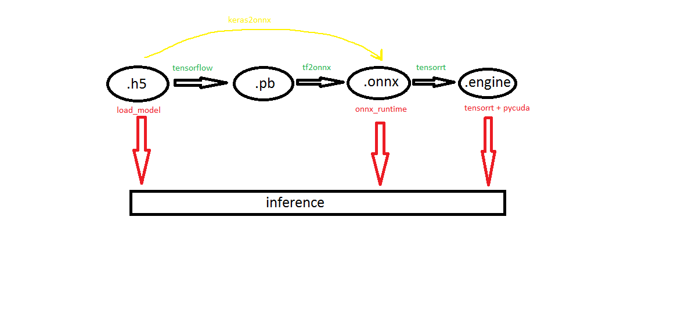

# robocup
Robocup2020. CV part (Jetson Nano + RealSense D415).

**Input:** detect objects, calculate x y z coordinates and angle orientation on table for grasping task with manipulator. 

**Output:** trained U-net model for multiclass segmentation and optimized for inference on Jetson Nano.

Benefit: Accurate T-shaped objects grab with perfect gripper orientation that other teams could not do with their 2D Yolo detectors.
